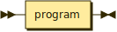
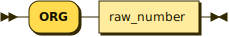
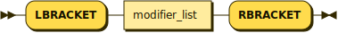
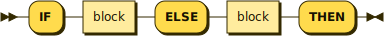
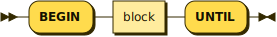
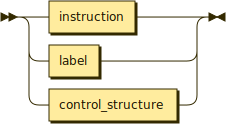

**start:**



```
start    ::= program
```

**program:**


```
program  ::= ( statement | org_directive | arch_flag_directive | define_directive )*
```

referenced by:

* start

**statement_type:**


```
statement_type
         ::= label
           | instruction
           | macro_def
           | include_stmt
           | control_structure
           | memory_init_statement
```

referenced by:

* statement

**statement:**


```
statement
         ::= statement_type ( _WS_REQ statement_type )*
```

referenced by:

* program

**org_directive:**



```
org_directive
         ::= 'ORG' raw_number
```

referenced by:

* program

**arch_flag_directive:**


```
arch_flag_directive
         ::= 'ARCH_FLAG' 'IDENT' ( 'IDENT' | 'RAW_HEX' | 'RAW_DECIMAL' )
```

referenced by:

* program

**define_directive:**


```
define_directive
         ::= 'DEFINE' 'IDENT' ( 'RAW_HEX' | 'RAW_DECIMAL' | 'IDENT' | 'RAW_CHAR' )
```

referenced by:

* program

**memory_init_statement:**


```
memory_init_statement
         ::= ( 'RAW_HEX' | 'RAW_DECIMAL' | 'RAW_CHAR' ) 'COMMA'
```

referenced by:

* statement_type

**include_stmt:**


```
include_stmt
         ::= 'INCLUDE' 'STRING'
```

referenced by:

* statement_type

**label:**


```
label    ::= 'COLON' 'IDENT'
```

referenced by:

* block_item
* statement_type

**raw_number:**


```
raw_number
         ::= 'RAW_HEX'
           | 'RAW_DECIMAL'
           | 'RAW_CHAR'
```

referenced by:

* instruction
* org_directive

**labelref:**


```
labelref ::= 'TICK' 'IDENT'
```

referenced by:

* jump_op

**instruction:**


```
instruction
         ::= raw_number
           | jump_op
           | alu_op
           | 'IDENT'
           | address_of
```

referenced by:

* block_item
* macro_body
* statement_type

**jump_op:**


```
jump_op  ::= ( 'JMP' | 'ZJMP' | 'CALL' ) labelref
```

referenced by:

* instruction

**address_of:**


```
address_of
         ::= 'TICK' 'IDENT'
```

referenced by:

* instruction

**alu_op:**


```
alu_op   ::= basic_alu modifiers?
```

referenced by:

* instruction

**basic_alu:**


```
basic_alu
         ::= 'T'
           | 'N'
           | 'THIRD_OS'
           | 'T_PLUS_N'
           | 'T_AND_N'
           | 'T_OR_N'
           | 'T_XOR_N'
           | 'NOT_T'
           | 'N_EQ_T'
           | 'N_LT_T'
           | 'N_ULT_T'
           | 'T2_DIV'
           | 'T2_MUL'
           | 'RT'
           | 'N_MINUS_T'
           | 'IO_T'
           | 'STATUS'
           | 'RSTATUS'
           | 'NLSHIFT_T'
           | 'NRSHIFT_T'
           | 'NARSHIFT_T'
           | 'L_UM_MUL'
           | 'H_UM_MUL'
           | 'T_PLUS_1'
           | 'T_MINUS_1'
           | 'MEM_T'
```

referenced by:

* alu_op

**modifiers:**



```
modifiers
         ::= 'LBRACKET' modifier_list 'RBRACKET'
```

referenced by:

* alu_op

**modifier_list:**


```
modifier_list
         ::= modifier ( 'COMMA' modifier )*
```

referenced by:

* modifiers

**modifier:**


```
modifier ::= stack_effect
           | stack_delta
```

referenced by:

* modifier_list

**stack_effect:**


```
stack_effect
         ::= 'T_TO_N'
           | 'T_TO_R'
           | 'N_TO_MEM'
           | 'N_TO_IO'
           | 'IORD'
           | 'DINT'
           | 'EINT'
           | 'RET'
```

referenced by:

* modifier

**stack_delta:**


```
stack_delta
         ::= data_stack_delta
           | return_stack_delta
```

referenced by:

* modifier

**data_stack_delta:**


```
data_stack_delta
         ::= 'D_PLUS_0'
           | 'D_PLUS_1'
           | 'D_MINUS_1'
           | 'D_MINUS_2'
```

referenced by:

* stack_delta

**return_stack_delta:**


```
return_stack_delta
         ::= 'R_PLUS_0'
           | 'R_PLUS_1'
           | 'R_MINUS_1'
           | 'R_MINUS_2'
```

referenced by:

* stack_delta

**macro_def:**


```
macro_def
         ::= 'MACRO' 'IDENT' 'STACK_COMMENT'? macro_body 'ENDMACRO'
```

referenced by:

* statement_type

**macro_body:**


```
macro_body
         ::= instruction+
```

referenced by:

* macro_def

**control_structure:**


```
control_structure
         ::= if_then
           | if_else_then
           | loop_until
           | loop_while
           | do_loop
           | do_plus_loop
```

referenced by:

* block_item
* statement_type

**if_then:**


```
if_then  ::= 'IF' block 'THEN'
```

referenced by:

* control_structure

**if_else_then:**



```
if_else_then
         ::= 'IF' block 'ELSE' block 'THEN'
```

referenced by:

* control_structure

**loop_until:**



```
loop_until
         ::= 'BEGIN' block 'UNTIL'
```

referenced by:

* control_structure

**loop_while:**


```
loop_while
         ::= 'BEGIN' block 'WHILE' block 'REPEAT'
```

referenced by:

* control_structure

**do_loop:**


```
do_loop  ::= 'DO' block 'LOOP'
```

referenced by:

* control_structure

**do_plus_loop:**


```
do_plus_loop
         ::= 'DO' block 'PLUS_LOOP'
```

referenced by:

* control_structure

**block:**


```
block    ::= block_item+
```

referenced by:

* do_loop
* do_plus_loop
* if_else_then
* if_then
* loop_until
* loop_while

**block_item:**



```
block_item
         ::= instruction
           | label
           | control_structure
```

referenced by:

* block

## 
 <sup>generated by [RR - Railroad Diagram Generator][RR]</sup>

[RR]: https://www.bottlecaps.de/rr/ui